# Homework 0
> Due 10/10/2020 23:59:59 PDT

## Getting Started

This note will demonstrate how to setup the environment to do your homework. For first time programmers, the process may seem intimidating. But I promise this will get a lot easier once you get use to it.

Since the course is taught remotely, this note will refer to some services provide by the school to minimize software troubles.

### Davis VPN (OPTIONAL)

Davis provide VPN for all students. To gain access to Davis VPN, please refer to this [article](https://www.library.ucdavis.edu/service/connect-from-off-campus/).

**!IMPORTANT  You may need to activate your Davis VPN in order to access your instructional Account!**

### Instructional Accounts (OPTIONAL)

If you are enrolled in this course, you will have an access to a instructional account.  More details
[here](https://www.cs.ucdavis.edu/csif/about-us/accounts-quotas/).

Note:  If you are waitlisted student and you are not a computer science major.  You need to contact CSIF staff directly to get access to an account.  **You do not need an instructional account to complete the course.**  Having one may be helpful if you encounter technical issues on your own computer.  

`ssh [YOUR-SSID]@[computer-name].cs.ucdavis.edu `

Example:

If your ssid is `jxyl`,

`ssh jxyl@pc10.cs.ucdavis.edu `

If the connection is established, your terminal will ask you for [YOUR-PASSWORD]

For future reference, we will use [YOUR-SSID] and [YOUR-PASSWORD] in the rest of the document.
Your [YOUR-SSID] and [YOUR-PASSWORD] are what you use to login into your regular Davis Student account.

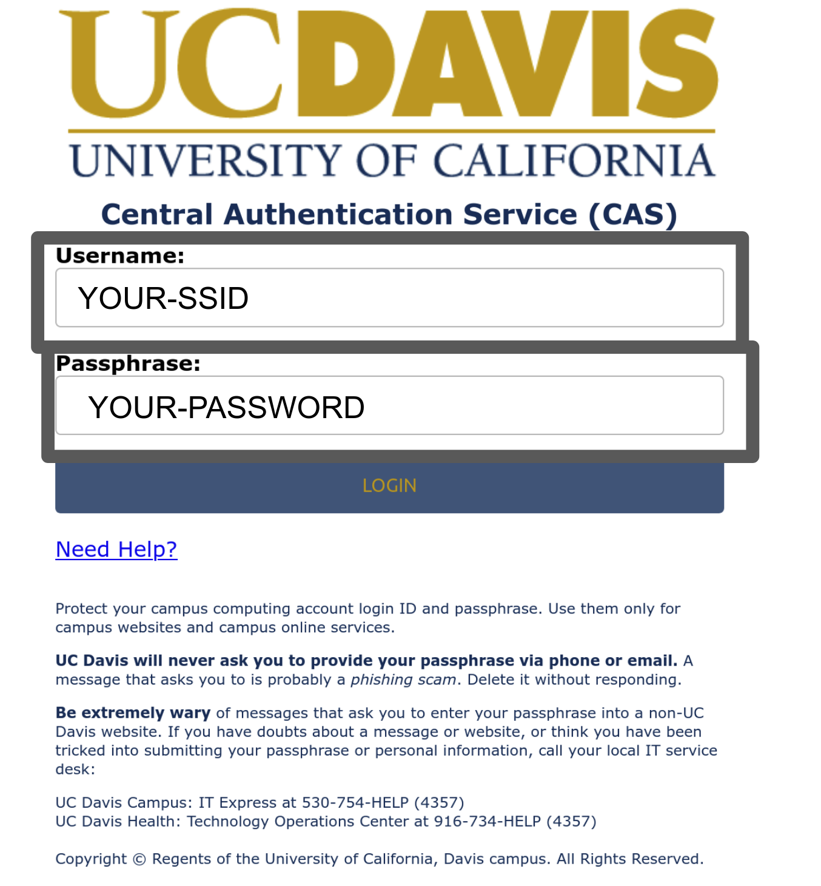

## Terminal

As a developer, computer **terminal**, the interface in which you input command to the operating system, will be your best friend. The definition of terminal evolved over time along with computers. Today, the term **terminal** are used interchangablly with **shell** and **command line interface (cli)**. For detailed explanation, check out [terminal](#Terminal\ vs\ Command\ Prompt\ vs\ Commandline\ Interface).

### Windows

In windows, the prefered terminal to use is **Power Shell**. You can access windows powershell by typing `PowerShell` into the search bar.

Powershell exists for all the windows OS since windows 7 SP1. If by any means, you do not have powershell on your windows machine.[Gitbash](https://git-scm.com/downloads) is a good alternative.

### MacOS/Linux

MacOS and Linux all came from Unix family. This means their commandline interface (terminal) are extremely similar. You can access the terminal with the command `ctrl-alt-T` (for linux) or `cmd-alt-T` for macOS.

> 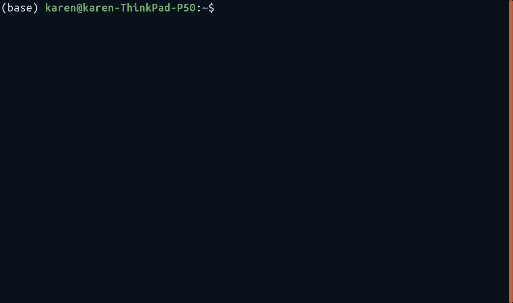

An example ubuntu terminal.

After you complete opening the terminal, you can proceed to [installing python](#Installing\ Python).

## Installing Python

We will be installing [python-3.8](https://www.python.org/downloads/)

(*Note from TA: From this website, you can see there are many active python releases. Ideally, you should download the latest stable python version or the python version specificed by the project you are currently working on.*)

### Windows Machine

You can download python installer [here](https://www.python.org/ftp/python/3.8.6/python-3.8.6-amd64.exe).

### MacOS/Linux

You can download python installer [here](https://www.python.org/ftp/python/3.8.6/python-3.8.6-macosx10.9.pkg).

### Linux

For Ubuntu machine (school machine), python3 is already installed. For your own machine, you can install python3 by

`sudo apt install python3`

(*TA's Note: This command works for ubuntu. Every distro has its own terminal language to download python3.*)

### Virtual Environment

For more explanation on  virtual environment, checkout [FAQ](#Virtualenv).

## Jupyter Notebook

In some homework, we will be using [jupyter notebook](https://jupyter.org/install), a program extremely popular in modern data analysis that allows you to make notes while programming in python.

In order to use jupyter notebook, you can install it with

`pip install notebook`

after installing python (*or activating your virtual environment [OPTIONAL]*).

## IDE

An IDE, or (Integrated Development Environment) is a piece of software that are designed to faciliate software development process.  Ideally, an IDE has a text editor, build automaton tool, and debugger.

The preferred IDE to use (By TA) for Python are

1. [Microsoft VS Code](https://code.visualstudio.com/)
2. [PyCharm](https://www.jetbrains.com/pycharm/)

To complete the assignments, these IDE are recommended by not required.  Feel free to use any IDE you prefer.

## Homework Submission

UC Davis ECS32A uses ok autograder, developed in UC Berkeley, to test and submit homework assignments. We will release homework through two methods.

1. zip folder through canvas
2. [github repository](https://github.com/Davis-ECS32A-Fall2020/hw0.git)

### Downloading Homework

1. You can download the assignment in the files tab on canvas.

- Open the location of the downloaded assignment
- Unzip the homework folder as `[UNZIP_LOCATION]/hw0/`
- run `cd [UNZIP_LOCATION]/hw0/`

2. Github Version:

- In your terminal, run
  `git clone https://github.com/Davis-ECS32A-Fall2020/hw0.git`
- enter your homework folder with
  `cd hw0`

- To verify you are in the correct folder, run `ls` in your terminal and you should see a folder with a file named ok.

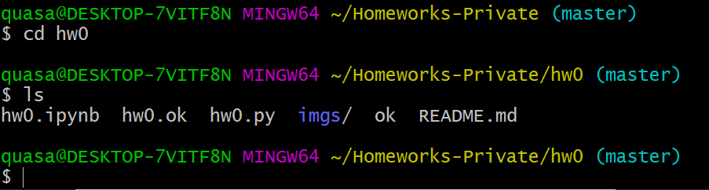

or

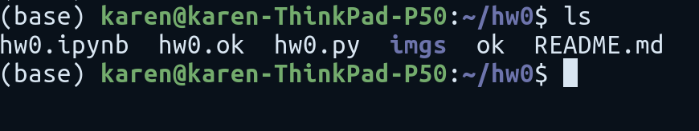

Note in the first example, hw0 is located under `Homeworks-Private` Folder.  And in the bottom, hw0 is located under `~`.  These are where TA decide to unzip hw0, aka `[UNZIP_LOCATION]`.  You can customize your own [UNZIP_LOCATION].

### Virtual Environment

Here is a good place to activate your virtual environment.

### First Time signing in with ok

After you complete the instruction in [Downloading Homework](#Downloading\ Homework), you can run the command:

`python3 ok`

or

`python ok`

Make sure your `python --version` starts with 3.

It's okay if the test fail first. The score displayed will not be your actual score unless you submit. The prompt should ask you for your ucdavis email. Your account is already registered with your school email on okpy. **Please Contact the TA if you are not registered on OKPY.** After entering your canvas email, your webbrowser will open an authenticatin page, please click accept to proceed.

Ideally, your terminal should look like:

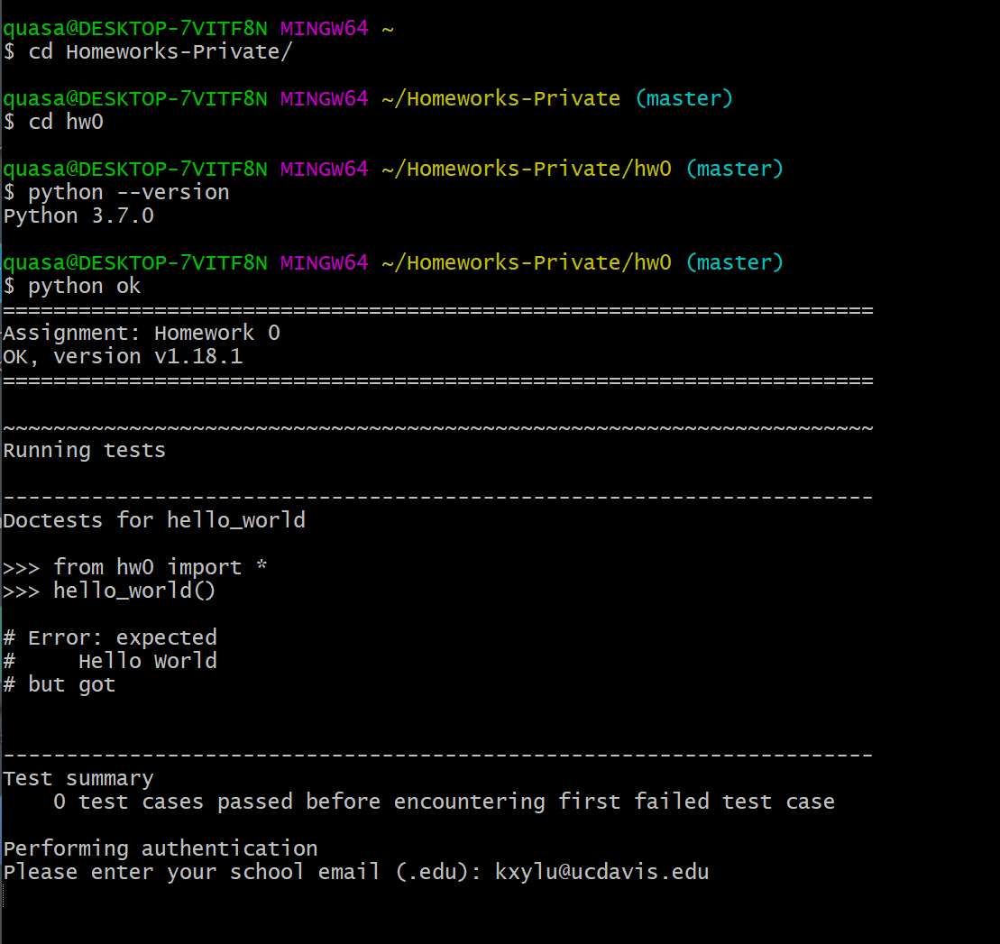

and your browser should pop out an authentication page
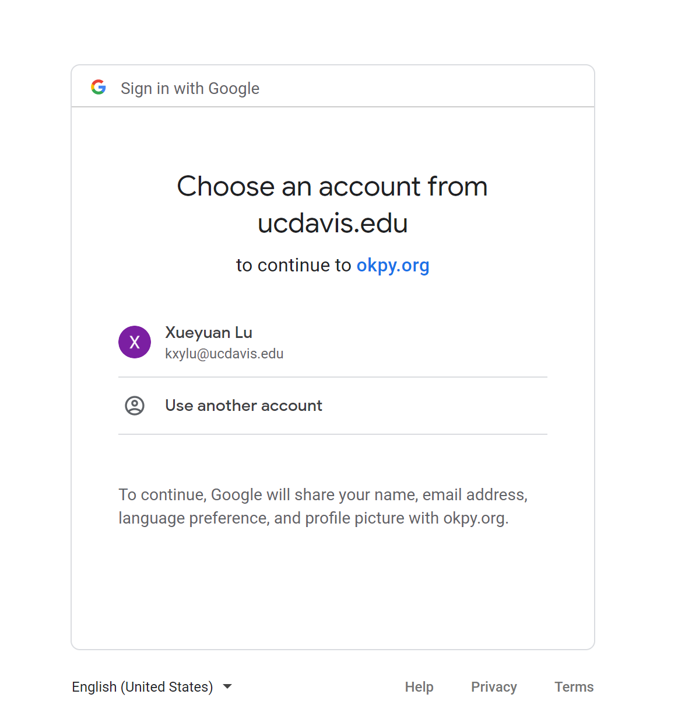

After clicking on the corresponding email, you should get a confirmation page.

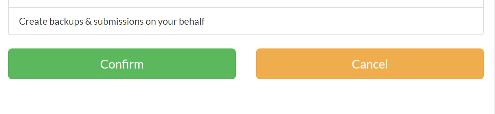

**We will not be asking your password.  The information access is solely for linking your homework with your school email.**

### Testing with OK

Okpy uses doc string to test your code. For homework 0, there will only be one question, you can run

`python3 ok -q hello_world`

to verify your code is correct.

You can also test all questions with

`python3 ok`

If you passed all of the test, your result should look like:

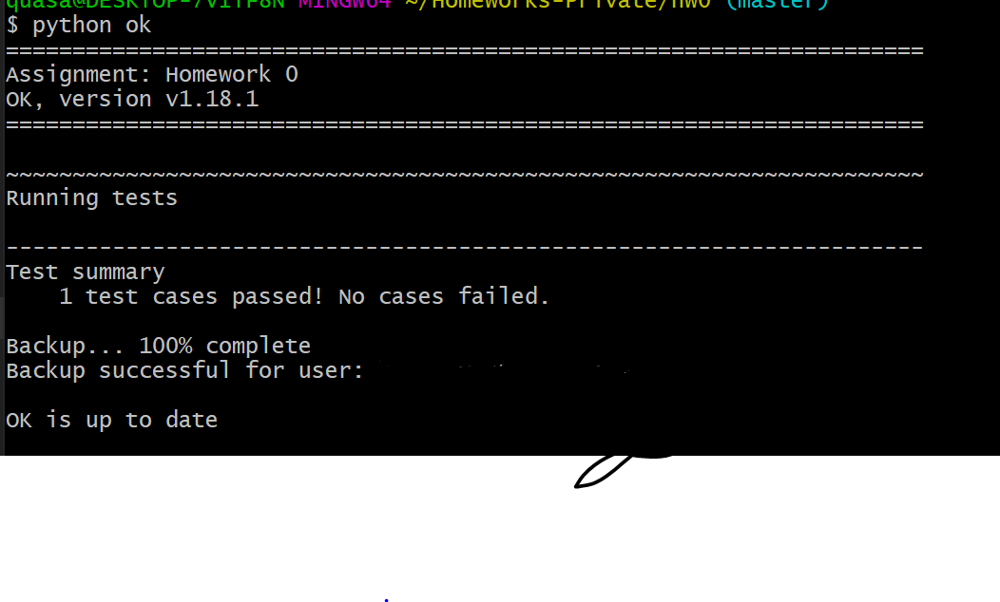

### Submitting Homework

You can submit your assignment with

`python3 ok --submit`

After submission, ok will display a submission URL, which you can verify your submission.

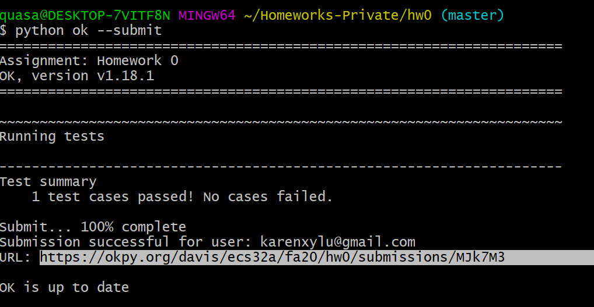

The url should siplay something like:

This page is a proof you subimtted your assignment.

## Detailed Explanation

### Terminal vs Command Prompt vs Commandline Interface

A **terminal** refers to something you can enter inputs into a computer.  (Think of *endpoints*, a train station terminal is an endpoint to connect to trains.  Computer terminal is like an exit to connect to the real world.)

A **Shell** is a user interface to access an operating system's services.  A shell can be **commandline interface* or *graphical user interface* (GUI). 

**Commandline interface** is a program that process commands in form of text.  Powershell is a commandline interface. As opposed to *Graphical User Interface* is a visual way of interacting with a computer.  (Usually pretty with pictures and stuff)

Currently, we use these terms interchangably becaue current operating systems provide a **shell** program in the form of **cli** as a terminal. 

### Python Virtual Environment [Optional][highly recommended]

**What is a python virtual environment?**
Python virtual environment is a tool that helps to keep dependencies required by different projects separate by creating isolated 'environment' for them. [source](https://www.geeksforgeeks.org/python-virtual-environment/)

1. What is a dependency?

   - When developing python, you will be prompt to use premade libraries. For example, data scientists may need to use `numpy`. A dependency refers to the specific library version your code is built on top of.

2. Why do we need to specify dependency?
   - Because developers of such library may change their source code. If your homework1 and homework2 both uses numpy library. However, your homework1 use verion 1.1 and homework 2 uses 1.2. If you specifcy your dependency, you can elimiate the possibility that your error is due to using the wrong library. Hence focus debugging process on your code itself.
3. How do virtual environment keep track of dependencies?

   - By python convention, whenever we run python3 in the terminal. The computer will look at the default PATH variable and identify where is the python3 program. Moreover, when you are importing an library, your computer will look at the PYTHONPATH for the location of the library you import. Every virtual environment comes with its own PATH and PYTHONPATH. When you are activated in enva, you can guarantee the python you are using are independent of python version in envb.

**How to install your virtual environment?**

Here you have two options:

- virtualenv

- conda

#### Virtualenv

You can install virtualenv with

`pip install virtualenv`

To Create an virtual environment, run

`python -m [VirtualEnvName] [PATH-TO-VIRTUAL-ENV]`

Then you can activate your virtual environment with

`source [PATH-TO-VIRTUAL-ENV]/bin/activate`

After you successfully installed and activated your virtual environment, you can install the required library again with

`pip install -r requirements`

### Conda

Anaconda identify itself as the birthplace of python data science. It is highly recommended tool to learn for anyone interested in datascience. Anaconda is out of the scope of this course. If interested, please refer to [conda](https://docs.anaconda.com/anaconda/install/)

## FAQ

### What is Git?

Github is a version control system extremely popular among developers. (Alternatives include gitlab, gitee, bitbucket.) If your goal is to become a CS developer, then having a github account is a huge bonus to your resume. (Some companies even require your github account link.) A **version control system** keeps track of the code changes and facilitate collaboration with other people. So far, the only git command you need to know is

`git clone [URL]`

To install git, please refer to this [link](https://git-scm.com/book/en/v2/Getting-Started-Installing-Git).

If you are a windows user and decide to use git, a good terminal to use is gitbash.  You can install git for windows [here](https://gitforwindows.org/).

And click the download to get the following installer:

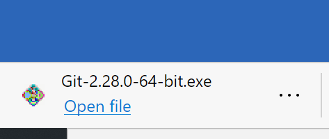

You can follow use default following the installation wizard.

After installation, you can open git-bash like follows:

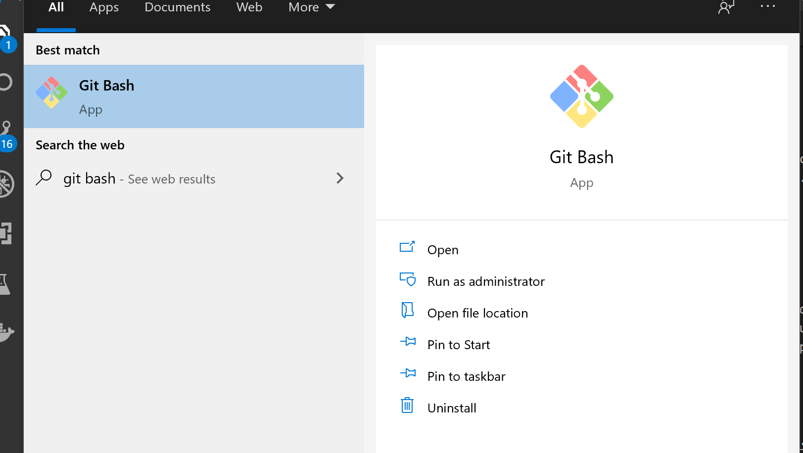

### That's a lot of information. Can you give a list of what we should know and what we need to know to pass the course?

**What you need to know to pass the course**

1. Python
2. How to submit homework

**What do you need to know in order to become fluent with computer science? (aka excel in this course)**

1. Python
2. Git
3. Terminal
4. Virtual Environment/Conda
5. Path Variables
6. Pip

### Wait, did the TA just give out the answer to hw0?

- Yes, that is intended to minimize the fuss.  The point of hw0 is to familarize everyone with the submission system and resolve any issues before the real homework starts.
